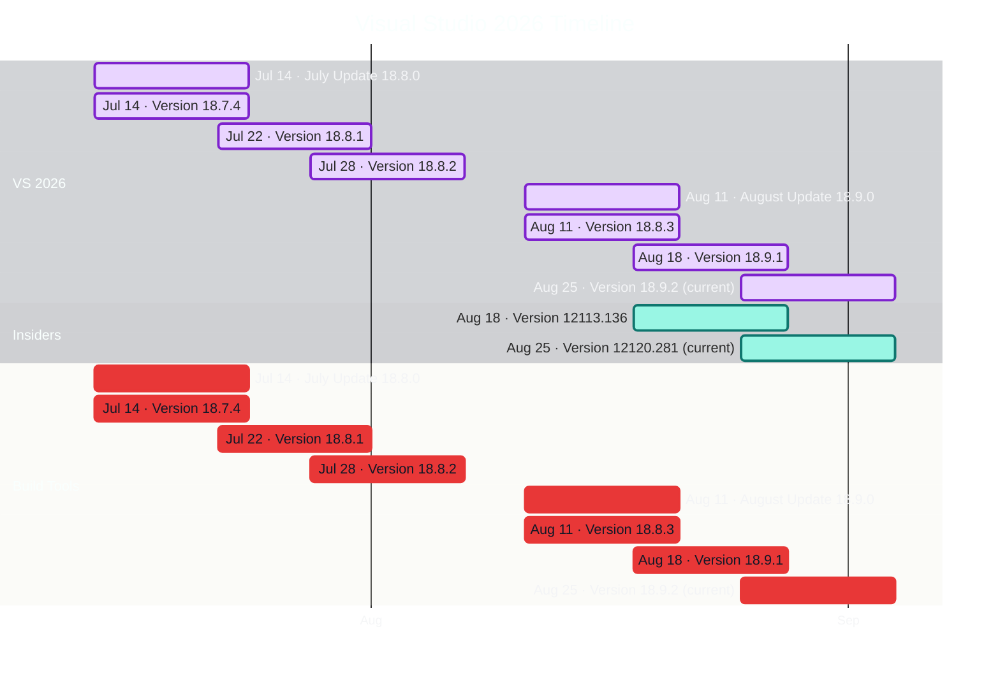

# Visual Studio 2026 Timeline

Updated: 2026-08-25T00:00:00.0000000+00:00 (UTC)

Roadmap window: **only months with published releases**.

Repository README: [VisualStudioUpdate README](https://github.com/Oxelya-DevTools/VisualStudioUpdate/blob/master/README.md)

## Releases

| Date (UTC) | Channel | Version | Release notes |
| --- | --- | --- | --- |
| 2026-08-25 | VS 2026 | Version 18.9.2 | [Open](https://learn.microsoft.com/en-us/visualstudio/releases/2026/release-notes#18.9.2) |
| 2026-08-25 | Insiders | Version 12120.281 | [Open](https://learn.microsoft.com/en-us/visualstudio/releases/2026/release-notes-insiders#12120.281) |
| 2026-08-25 | Build Tools | Version 18.9.2 | [Open](https://learn.microsoft.com/en-us/visualstudio/releases/2026/release-notes?tabs=buildtools#18.9.2) |
| 2026-08-18 | VS 2026 | Version 18.9.1 | [Open](https://learn.microsoft.com/en-us/visualstudio/releases/2026/release-notes#18.9.1) |
| 2026-08-18 | Insiders | Version 12113.136 | [Open](https://learn.microsoft.com/en-us/visualstudio/releases/2026/release-notes-insiders#12113.136) |
| 2026-08-18 | Build Tools | Version 18.9.1 | [Open](https://learn.microsoft.com/en-us/visualstudio/releases/2026/release-notes?tabs=buildtools#18.9.1) |
| 2026-08-11 | VS 2026 | Version 18.8.3 | [Open](https://learn.microsoft.com/en-us/visualstudio/releases/2026/release-notes#18.8.3) |
| 2026-08-11 | VS 2026 | August Update 18.9.0 | [Open](https://learn.microsoft.com/en-us/visualstudio/releases/2026/release-notes#august-update-1890) |
| 2026-08-11 | Build Tools | Version 18.8.3 | [Open](https://learn.microsoft.com/en-us/visualstudio/releases/2026/release-notes?tabs=buildtools#18.8.3) |
| 2026-08-11 | Build Tools | August Update 18.9.0 | [Open](https://learn.microsoft.com/en-us/visualstudio/releases/2026/release-notes?tabs=buildtools#august-update-1890) |
| 2026-07-28 | VS 2026 | Version 18.8.2 | [Open](https://learn.microsoft.com/en-us/visualstudio/releases/2026/release-notes#18.8.2) |
| 2026-07-28 | Build Tools | Version 18.8.2 | [Open](https://learn.microsoft.com/en-us/visualstudio/releases/2026/release-notes?tabs=buildtools#18.8.2) |
| 2026-07-22 | VS 2026 | Version 18.8.1 | [Open](https://learn.microsoft.com/en-us/visualstudio/releases/2026/release-notes#18.8.1) |
| 2026-07-22 | Build Tools | Version 18.8.1 | [Open](https://learn.microsoft.com/en-us/visualstudio/releases/2026/release-notes?tabs=buildtools#18.8.1) |
| 2026-07-14 | VS 2026 | Version 18.7.4 | [Open](https://learn.microsoft.com/en-us/visualstudio/releases/2026/release-notes#18.7.4) |
| 2026-07-14 | VS 2026 | July Update 18.8.0 | [Open](https://learn.microsoft.com/en-us/visualstudio/releases/2026/release-notes#july-update-1880) |
| 2026-07-14 | Build Tools | Version 18.7.4 | [Open](https://learn.microsoft.com/en-us/visualstudio/releases/2026/release-notes?tabs=buildtools#18.7.4) |
| 2026-07-14 | Build Tools | July Update 18.8.0 | [Open](https://learn.microsoft.com/en-us/visualstudio/releases/2026/release-notes?tabs=buildtools#july-update-1880) |
| 2026-06-30 | VS 2026 | Version 18.7.3 | [Open](https://learn.microsoft.com/en-us/visualstudio/releases/2026/release-notes#18.7.3) |
| 2026-06-30 | Build Tools | Version 18.7.3 | [Open](https://learn.microsoft.com/en-us/visualstudio/releases/2026/release-notes?tabs=buildtools#18.7.3) |
| 2026-06-23 | VS 2026 | Version 18.7.2 | [Open](https://learn.microsoft.com/en-us/visualstudio/releases/2026/release-notes#18.7.2) |
| 2026-06-23 | Build Tools | Version 18.7.2 | [Open](https://learn.microsoft.com/en-us/visualstudio/releases/2026/release-notes?tabs=buildtools#18.7.2) |
| 2026-06-16 | VS 2026 | Version 18.7.1 | [Open](https://learn.microsoft.com/en-us/visualstudio/releases/2026/release-notes#18.7.1) |
| 2026-06-16 | Build Tools | Version 18.7.1 | [Open](https://learn.microsoft.com/en-us/visualstudio/releases/2026/release-notes?tabs=buildtools#18.7.1) |
| 2026-06-09 | VS 2026 | Version 18.6.3 | [Open](https://learn.microsoft.com/en-us/visualstudio/releases/2026/release-notes#18.6.3) |
| 2026-06-09 | VS 2026 | June Update 18.7.0 | [Open](https://learn.microsoft.com/en-us/visualstudio/releases/2026/release-notes#june-update-1870) |
| 2026-06-09 | Build Tools | Version 18.6.3 | [Open](https://learn.microsoft.com/en-us/visualstudio/releases/2026/release-notes?tabs=buildtools#18.6.3) |
| 2026-06-09 | Build Tools | June Update 18.7.0 | [Open](https://learn.microsoft.com/en-us/visualstudio/releases/2026/release-notes?tabs=buildtools#june-update-1870) |
| 2026-05-27 | VS 2026 | Version 18.6.2 | [Open](https://learn.microsoft.com/en-us/visualstudio/releases/2026/release-notes#18.6.2) |
| 2026-05-27 | Build Tools | Version 18.6.2 | [Open](https://learn.microsoft.com/en-us/visualstudio/releases/2026/release-notes?tabs=buildtools#18.6.2) |
| 2026-05-20 | VS 2026 | Version 18.6.1 | [Open](https://learn.microsoft.com/en-us/visualstudio/releases/2026/release-notes#18.6.1) |
| 2026-05-20 | Build Tools | Version 18.6.1 | [Open](https://learn.microsoft.com/en-us/visualstudio/releases/2026/release-notes?tabs=buildtools#18.6.1) |
| 2026-05-12 | VS 2026 | Version 18.5.3 | [Open](https://learn.microsoft.com/en-us/visualstudio/releases/2026/release-notes#18.5.3) |
| 2026-05-12 | VS 2026 | May Update 18.6.0 | [Open](https://learn.microsoft.com/en-us/visualstudio/releases/2026/release-notes#may-update-1860) |
| 2026-05-12 | Build Tools | Version 18.5.3 | [Open](https://learn.microsoft.com/en-us/visualstudio/releases/2026/release-notes?tabs=buildtools#18.5.3) |
| 2026-05-12 | Build Tools | May Update 18.6.0 | [Open](https://learn.microsoft.com/en-us/visualstudio/releases/2026/release-notes?tabs=buildtools#may-update-1860) |
| 2026-04-28 | VS 2026 | Version 18.5.2 | [Open](https://learn.microsoft.com/en-us/visualstudio/releases/2026/release-notes#18.5.2) |
| 2026-04-28 | Build Tools | Version 18.5.2 | [Open](https://learn.microsoft.com/en-us/visualstudio/releases/2026/release-notes?tabs=buildtools#18.5.2) |
| 2026-04-21 | VS 2026 | Version 18.5.1 | [Open](https://learn.microsoft.com/en-us/visualstudio/releases/2026/release-notes#18.5.1) |
| 2026-04-21 | Build Tools | Version 18.5.1 | [Open](https://learn.microsoft.com/en-us/visualstudio/releases/2026/release-notes?tabs=buildtools#18.5.1) |
| 2026-04-14 | VS 2026 | Version 18.4.4 | [Open](https://learn.microsoft.com/en-us/visualstudio/releases/2026/release-notes#18.4.4) |
| 2026-04-14 | VS 2026 | April Update 18.5.0 | [Open](https://learn.microsoft.com/en-us/visualstudio/releases/2026/release-notes#april-update-1850) |
| 2026-04-14 | Build Tools | Version 18.4.4 | [Open](https://learn.microsoft.com/en-us/visualstudio/releases/2026/release-notes?tabs=buildtools#18.4.4) |
| 2026-04-14 | Build Tools | April Update 18.5.0 | [Open](https://learn.microsoft.com/en-us/visualstudio/releases/2026/release-notes?tabs=buildtools#april-update-1850) |
| 2026-03-31 | VS 2026 | Version 18.4.3 | [Open](https://learn.microsoft.com/en-us/visualstudio/releases/2026/release-notes#18.4.3) |
| 2026-03-31 | Build Tools | Version 18.4.3 | [Open](https://learn.microsoft.com/en-us/visualstudio/releases/2026/release-notes?tabs=buildtools#18.4.3) |
| 2026-03-24 | VS 2026 | Version 18.4.2 | [Open](https://learn.microsoft.com/en-us/visualstudio/releases/2026/release-notes#18.4.2) |
| 2026-03-24 | Build Tools | Version 18.4.2 | [Open](https://learn.microsoft.com/en-us/visualstudio/releases/2026/release-notes?tabs=buildtools#18.4.2) |
| 2026-03-17 | VS 2026 | Version 18.4.1 | [Open](https://learn.microsoft.com/en-us/visualstudio/releases/2026/release-notes#18.4.1) |
| 2026-03-17 | Build Tools | Version 18.4.1 | [Open](https://learn.microsoft.com/en-us/visualstudio/releases/2026/release-notes?tabs=buildtools#18.4.1) |
| 2026-03-10 | VS 2026 | Version 18.3.3 | [Open](https://learn.microsoft.com/en-us/visualstudio/releases/2026/release-notes#18.3.3) |
| 2026-03-10 | VS 2026 | March Update 18.4.0 | [Open](https://learn.microsoft.com/en-us/visualstudio/releases/2026/release-notes#march-update-1840) |
| 2026-03-10 | Build Tools | Version 18.3.3 | [Open](https://learn.microsoft.com/en-us/visualstudio/releases/2026/release-notes?tabs=buildtools#18.3.3) |
| 2026-03-10 | Build Tools | March Update 18.4.0 | [Open](https://learn.microsoft.com/en-us/visualstudio/releases/2026/release-notes?tabs=buildtools#march-update-1840) |
| 2026-02-24 | VS 2026 | Version 18.3.2 | [Open](https://learn.microsoft.com/en-us/visualstudio/releases/2026/release-notes#18.3.2) |
| 2026-02-24 | Build Tools | Version 18.3.2 | [Open](https://learn.microsoft.com/en-us/visualstudio/releases/2026/release-notes?tabs=buildtools#18.3.2) |
| 2026-02-18 | VS 2026 | Version 18.3.1 | [Open](https://learn.microsoft.com/en-us/visualstudio/releases/2026/release-notes#18.3.1) |
| 2026-02-18 | Build Tools | Version 18.3.1 | [Open](https://learn.microsoft.com/en-us/visualstudio/releases/2026/release-notes?tabs=buildtools#18.3.1) |
| 2026-02-10 | VS 2026 | Version 18.2.2 | [Open](https://learn.microsoft.com/en-us/visualstudio/releases/2026/release-notes#18.2.2) |
| 2026-02-10 | VS 2026 | February Update 18.3.0 | [Open](https://learn.microsoft.com/en-us/visualstudio/releases/2026/release-notes#february-update-1830) |
| 2026-02-10 | Build Tools | Version 18.2.2 | [Open](https://learn.microsoft.com/en-us/visualstudio/releases/2026/release-notes?tabs=buildtools#18.2.2) |
| 2026-02-10 | Build Tools | February Update 18.3.0 | [Open](https://learn.microsoft.com/en-us/visualstudio/releases/2026/release-notes?tabs=buildtools#february-update-1830) |
| 2026-01-20 | VS 2026 | Version 18.2.1 | [Open](https://learn.microsoft.com/en-us/visualstudio/releases/2026/release-notes#18.2.1) |
| 2026-01-20 | Build Tools | Version 18.2.1 | [Open](https://learn.microsoft.com/en-us/visualstudio/releases/2026/release-notes?tabs=buildtools#18.2.1) |
| 2026-01-13 | VS 2026 | January Update 18.2.0 | [Open](https://learn.microsoft.com/en-us/visualstudio/releases/2026/release-notes#january-update-1820) |
| 2026-01-13 | Build Tools | January Update 18.2.0 | [Open](https://learn.microsoft.com/en-us/visualstudio/releases/2026/release-notes?tabs=buildtools#january-update-1820) |
| 2025-12-16 | VS 2026 | Version 18.1.1 | [Open](https://learn.microsoft.com/en-us/visualstudio/releases/2026/release-notes#18.1.1) |
| 2025-12-16 | Build Tools | Version 18.1.1 | [Open](https://learn.microsoft.com/en-us/visualstudio/releases/2026/release-notes?tabs=buildtools#18.1.1) |
| 2025-12-09 | VS 2026 | December Update 18.1.0 | [Open](https://learn.microsoft.com/en-us/visualstudio/releases/2026/release-notes#december-update-1810) |
| 2025-12-09 | Build Tools | December Update 18.1.0 | [Open](https://learn.microsoft.com/en-us/visualstudio/releases/2026/release-notes?tabs=buildtools#december-update-1810) |
| 2025-11-24 | VS 2026 | Version 18.0.2 | [Open](https://learn.microsoft.com/en-us/visualstudio/releases/2026/release-notes#18.0.2) |
| 2025-11-24 | Build Tools | Version 18.0.2 | [Open](https://learn.microsoft.com/en-us/visualstudio/releases/2026/release-notes?tabs=buildtools#18.0.2) |
| 2025-11-19 | VS 2026 | Version 18.0.1 | [Open](https://learn.microsoft.com/en-us/visualstudio/releases/2026/release-notes#18.0.1) |
| 2025-11-19 | Build Tools | Version 18.0.1 | [Open](https://learn.microsoft.com/en-us/visualstudio/releases/2026/release-notes?tabs=buildtools#18.0.1) |
| 2025-11-11 | VS 2026 | November Update 18.0.0 | [Open](https://learn.microsoft.com/en-us/visualstudio/releases/2026/release-notes#november-update-1800) |
| 2025-11-11 | Build Tools | November Update 18.0.0 | [Open](https://learn.microsoft.com/en-us/visualstudio/releases/2026/release-notes?tabs=buildtools#november-update-1800) |
