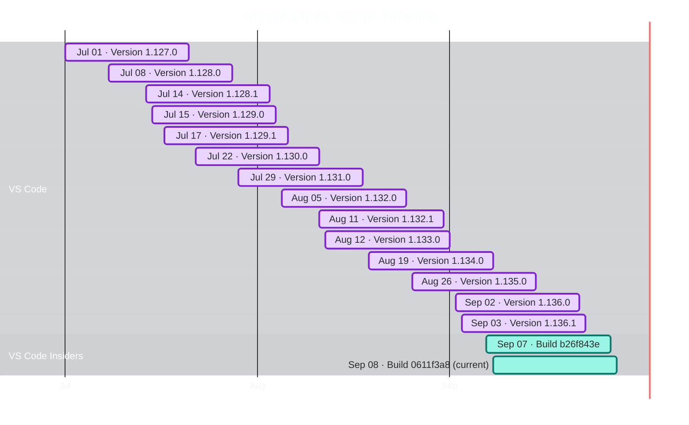

# Visual Studio Code Timeline

Updated: 2026-09-08T10:54:09.0000000+00:00 (UTC)

Roadmap window: **only months with published releases**.

Repository README: [VisualStudioUpdate README](https://github.com/Oxelya-DevTools/VisualStudioUpdate/blob/master/README.md)

## Releases

| Date (UTC) | Channel | Version | Release notes |
| --- | --- | --- | --- |
| 2026-09-08 | VS Code Insiders | Build 0611f3a8 | [Open](https://github.com/microsoft/vscode/commit/0611f3a8d9a6e8456c75742d876bc1823b4e1df1) |
| 2026-09-07 | VS Code Insiders | Build b26f843e | [Open](https://github.com/microsoft/vscode/commit/b26f843e546ae6d766fecdd225f5412269bfc952) |
| 2026-09-03 | VS Code | Version 1.136.1 | [Open](https://github.com/microsoft/vscode/releases/tag/1.136.1) |
| 2026-09-02 | VS Code | Version 1.136.0 | [Open](https://github.com/microsoft/vscode/releases/tag/1.136.0) |
| 2026-08-26 | VS Code | Version 1.135.0 | [Open](https://github.com/microsoft/vscode/releases/tag/1.135.0) |
| 2026-08-19 | VS Code | Version 1.134.0 | [Open](https://github.com/microsoft/vscode/releases/tag/1.134.0) |
| 2026-08-12 | VS Code | Version 1.133.0 | [Open](https://github.com/microsoft/vscode/releases/tag/1.133.0) |
| 2026-08-11 | VS Code | Version 1.132.1 | [Open](https://github.com/microsoft/vscode/releases/tag/1.132.1) |
| 2026-08-05 | VS Code | Version 1.132.0 | [Open](https://github.com/microsoft/vscode/releases/tag/1.132.0) |
| 2026-07-29 | VS Code | Version 1.131.0 | [Open](https://github.com/microsoft/vscode/releases/tag/1.131.0) |
| 2026-07-22 | VS Code | Version 1.130.0 | [Open](https://github.com/microsoft/vscode/releases/tag/1.130.0) |
| 2026-07-17 | VS Code | Version 1.129.1 | [Open](https://github.com/microsoft/vscode/releases/tag/1.129.1) |
| 2026-07-15 | VS Code | Version 1.129.0 | [Open](https://github.com/microsoft/vscode/releases/tag/1.129.0) |
| 2026-07-14 | VS Code | Version 1.128.1 | [Open](https://github.com/microsoft/vscode/releases/tag/1.128.1) |
| 2026-07-08 | VS Code | Version 1.128.0 | [Open](https://github.com/microsoft/vscode/releases/tag/1.128.0) |
| 2026-07-01 | VS Code | Version 1.127.0 | [Open](https://github.com/microsoft/vscode/releases/tag/1.127.0) |
| 2026-06-24 | VS Code | Version 1.126.0 | [Open](https://github.com/microsoft/vscode/releases/tag/1.126.0) |
| 2026-06-17 | VS Code | Version 1.125.0 | [Open](https://github.com/microsoft/vscode/releases/tag/1.125.0) |
| 2026-06-12 | VS Code | Version 1.124.2 | [Open](https://github.com/microsoft/vscode/releases/tag/1.124.2) |
| 2026-06-10 | VS Code | Version 1.124.0 | [Open](https://github.com/microsoft/vscode/releases/tag/1.124.0) |
| 2026-06-10 | VS Code | Version 1.123.2 | [Open](https://github.com/microsoft/vscode/releases/tag/1.123.2) |
| 2026-06-10 | VS Code | Version 1.123.1 | [Open](https://github.com/microsoft/vscode/releases/tag/1.123.1) |
| 2026-06-05 | VS Code | Version 1.123.0 | [Open](https://github.com/microsoft/vscode/releases/tag/1.123.0) |
| 2026-05-29 | VS Code | Version 1.122.1 | [Open](https://github.com/microsoft/vscode/releases/tag/1.122.1) |
| 2026-05-28 | VS Code | Version 1.122.0 | [Open](https://github.com/microsoft/vscode/releases/tag/1.122.0) |
| 2026-05-20 | VS Code | Version 1.121.0 | [Open](https://github.com/microsoft/vscode/releases/tag/1.121.0) |
| 2026-05-13 | VS Code | Version 1.120.0 | [Open](https://github.com/microsoft/vscode/releases/tag/1.120.0) |
| 2026-05-12 | VS Code | Version 1.119.1 | [Open](https://github.com/microsoft/vscode/releases/tag/1.119.1) |
| 2026-05-06 | VS Code | Version 1.119.0 | [Open](https://github.com/microsoft/vscode/releases/tag/1.119.0) |
| 2026-04-30 | VS Code | Version 1.118.1 | [Open](https://github.com/microsoft/vscode/releases/tag/1.118.1) |
| 2026-04-29 | VS Code | Version 1.118.0 | [Open](https://github.com/microsoft/vscode/releases/tag/1.118.0) |
